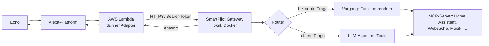

# SmartPilot

**Deine Alexa mit Superkräften.** Ein privat betriebener, deutscher
Sprachassistent: Amazon Echo fragt, dein eigener Server antwortet — schnell,
wo es zählt, und klug, wo es drauf ankommt.

- **Schnell, wo es zählt.** Klare, wiederkehrende Fragen — „Hausstatus",
  „Wetter", „Ist jemand zuhause?" — beantwortet ein fester Router
  deterministisch: gleiche Frage, gleiche Antwort, in Sekundenbruchteilen.
  Keine KI-Lotterie.
- **Klug, wo es drauf ankommt.** Alles Offene übernimmt ein LLM mit
  Werkzeugaufrufen — mit Kurzzeitgedächtnis für Folgefragen und Rückfragen bei
  Mehrdeutigkeit.
- **Eingebunden, nicht eingebildet.** Über MCP greift SmartPilot auf deine
  echte Welt zu: Smart Home, Websuche, Musik, Verkehr.
- **Privat & lokal.** Die Intelligenz läuft auf deiner eigenen Hardware. Deine
  Fragen bleiben bei dir.

## Wie es funktioniert



Zwei Wege, ein Flow: Der **Router** erkennt konfigurierte Vorgänge und
beantwortet sie ohne LLM (deterministisch) oder mit reiner Formulierung
(hybrid). Alles andere übernimmt der **Agent** — ein LLM, das selbst entscheidet,
welche Werkzeuge und Funktionen es braucht. Standard ist der
**OneShot-Modus** (eine Frage, eine Antwort); mit „Chat-Modus" bleibt die
Session für Folgefragen offen.

Details: [helpdoc/CONCEPTS.md](helpdoc/CONCEPTS.md) ·
[doc/ARCHITECTURE.md](doc/ARCHITECTURE.md)

## Schnellstart

Voraussetzungen: Docker mit Compose-Plugin und eine OpenAI-kompatible
LLM-Schnittstelle (mit Tool-Calling).

```bash
git clone https://github.com/dezihh/SmartPilot.git
cd SmartPilot
cp gateway/.env.example gateway/.env
# gateway/.env ausfüllen: AUTH_TOKEN, LLM_BASE_URL, LLM_API_KEY (Pflicht)
GATEWAY_PORT=8332 docker compose up -d --build
```

Danach: `http://<host>:8332/admin` öffnen, mit `AUTH_TOKEN` anmelden und im
Tab **Monitor / Test** die erste Frage stellen.

Die vollständige Anleitung mit allen Etappen, Prüfungen und der
Alexa-Anbindung: [helpdoc/INSTALLATION.md](helpdoc/INSTALLATION.md)

## Fähigkeiten als Pakete

Neue Systeme (Home Assistant, Music Assistant, Websuche, Wetter, Verkehr,
System-Info) kommen als **Installationspakete** — Tab „Wartung und Pakete" in
der Admin-Oberfläche. Ein Paket legt MCP-Server, Entity-Index, Funktionen und
Vorgänge in einem Rutsch an; du gibst nur Host, Port und Token ein.

- Verfügbare Pakete: [packages/de/index.json](packages/de/index.json)
- Eigene Pakete schreiben:
  [packages/README.md](packages/README.md) und
  [helpdoc/RECIPES.md](helpdoc/RECIPES.md)

## Dokumentation

| Kapitel | Inhalt |
|---|---|
| [Schnellstart](helpdoc/QUICKSTART.md) | Erste Antwort im Testmonitor, Schritt für Schritt |
| [Installation](helpdoc/INSTALLATION.md) | Gateway, Modell, Netzwerk, Alexa — Schritt für Schritt |
| [Grundbegriffe](helpdoc/CONCEPTS.md) | Werkzeug, Index, Funktion, Vorgang |
| [Konfiguration](helpdoc/CONFIGURATION.md) | Parametrier-Reihenfolge und Grundeinstellungen |
| [Praxisrezepte](helpdoc/RECIPES.md) | Home Assistant, Musik, Websuche, Wetter, Berichte |
| [Cache und Aktualität](helpdoc/CACHE.md) | Wann Daten lokal bleiben und wann Netzwerkverkehr entsteht |
| [Alexa anbinden](helpdoc/ALEXA.md) | Skill, Lambda, Sync und Härtung |
| [Fehler beheben](helpdoc/TROUBLESHOOTING.md) | Systematische Fehlersuche von innen nach außen |
| [Referenz](helpdoc/REFERENCE.md) | Felder, Bausteine, Env-Variablen, Sicherheitsgrenzen |

Design- und Architektur-Dokumente (Hintergrund für Entwickler):
[doc/](doc/ARCHITECTURE.md)

Betriebs-/CI-CD-Doku (Deployments, Workflows, Secrets-Namen):
[helpdoc/DEPLOYMENT.md](helpdoc/DEPLOYMENT.md)

## Sicherheit

- Alexa → AWS Lambda: Aufrufberechtigung auf die konfigurierte Skill-ID
  beschränkt
- AWS Lambda → `/api/query`: Bearer-Token (`AUTH_TOKEN`), constant-time
  verglichen
- `/admin/*`: Bearer-Token beziehungsweise Session-Login mit
  Brute-Force-Schutz
- JSON-Body-Limit, Non-Root-Container, gepinnte Dependencies, Secrets nur via
  `.env` (nie im Repo)
- Admin-UI nie im Internet exponieren; für öffentliche Deployments wird ein
  Reverse-Proxy mit TLS empfohlen — siehe
  [helpdoc/INSTALLATION.md](helpdoc/INSTALLATION.md#netzwerk-und-https)

## Repository-Struktur

```text
alexa/           Alexa-Skill: Lambda-Adapter (Python/ask-sdk), Interaktionsmodell, Sync-Skripte
gateway/         Gateway (Node.js 22 + TypeScript): Router, MCP-Clients, LLM-Agent, Admin-API
gateway/web/     Admin-Weboberfläche (vanilla HTML/CSS/JS)
packages/        Installationspakete (Registry + Manifeste)
helpdoc/         Nutzer-Dokumentation (Einstieg, Installation, Rezepte, Referenz)
doc/             Design- und Architektur-Dokumente
.github/         CI/CD: Smoke-Tests, Alexa-Modell-/Manifest-Sync, Lambda-Deployment
```

## Entwicklung

```bash
cd gateway
npm ci
npm run build        # TypeScript nach dist/
npm test             # Unit-Tests (node:test)
npm run dev          # tsx watch für Entwicklung
npm run smoke        # E2E-Smoke-Test gegen laufendes Gateway
```

Node.js ≥ 22 erforderlich. Details zur Architektur:
[doc/ARCHITECTURE.md](doc/ARCHITECTURE.md)

## Status

**In aktiver Entwicklung.** Der lokale Weg (Gateway + Testmonitor + Pakete)
ist stabil und getestet (22.09.2026); die Alexa-Anbindung läuft produktiv mit
eigener AWS-Lambda. Offene Punkte und Roadmap: Issues und
[doc/DESIGN_WEBUI.md](doc/DESIGN_WEBUI.md).
