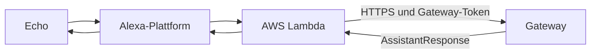

# Alexa anbinden

## Ziel

Alexa leitet eine freie Frage über Lambda an das bereits getestete Gateway
weiter und spricht dessen Antwort aus.

Beginne erst hier, wenn dieselbe Frage unter **Monitor / Test** funktioniert.

## Beteiligte Teile



Die Lambda ist ein dünner Adapter. Routing, Funktionen, Werkzeuge und LLM
bleiben im Gateway.

## Vorhandene Konfigurationsdateien

### Skill-Grundwerte

`alexa/skill.config.json` enthält:

```json
{
  "skill_name": "MeinHelfer",
  "invocation_name": "mein helfer",
  "assistant_name": "Dein Helfer"
}
```

### Lokale Skill-Zuordnung

Kopiere die Struktur aus `alexa/skill.local.json.example` in die ignorierte
lokale Datei `alexa/skill.local.json` und ersetze:

```json
{
  "skill_id": "amzn1.ask.skill.<deine-id>",
  "endpoint_url": "https://<gateway-host>/alexa",
  "privacy_url": "https://<gateway-host>/privacy"
}
```

### Lambda-Konfiguration

Die Vorlage `alexa/lambda/config.json.example` verlangt:

```json
{
  "gateway_url": "https://<gateway-host>",
  "gateway_token": "<AUTH_TOKEN des Gateways>",
  "watchdog_delay": "5",
  "gateway_timeout": "28",
  "skill_name": "MeinHelfer",
  "assistant_name": "Dein Helfer"
}
```

`gateway_url` ist die Basisadresse; die Lambda ergänzt den API-Pfad gemäß
ihrer Implementierung. `gateway_token` muss mit `AUTH_TOKEN` übereinstimmen.

## Skill-Modell synchronisieren

Das vorhandene Skript verwendet die ASK-CLI-Anmeldedaten und die lokale
Skill-Zuordnung:

1. ASK CLI installieren und einmal mit `ask configure` anmelden.
2. `alexa/skill.local.json` anlegen.
3. Im Repository `python alexa/scripts/sync_skill.py` ausführen.
4. Den gemeldeten Build-Status für Interaction Model und Manifest prüfen.

Optionen:

- `--model-only`: nur Interaktionsmodell
- `--manifest-only`: nur Manifest
- `--force`: auch ohne erkannte Änderung synchronisieren

## Gateway absichern

Setze im Gateway:

```dotenv
ALEXA_SKILL_ID=amzn1.ask.skill.<deine-id>
ALEXA_VERIFY_MODE=enforce
```

Der Skill-Endpunkt muss über HTTPS öffentlich erreichbar sein. Admin-UI und
Admin-API sollen nicht öffentlich erreichbar sein.

## Lambda bereitstellen

### Weg 1: GitHub-Workflow (dokumentiert und getestet)

Der Workflow `deploy-aws-lambda.yml` (manueller Start, `workflow_dispatch`)
erledigt alles in einem Durchlauf:

1. Baut das Zip aus `alexa/lambda/` (lambda_function.py + ask-sdk/requests)
2. Legt die Funktion `meinhelfer-alexa` an oder aktualisiert sie
   (Python 3.14, 512 MB, Timeout konfigurierbar, Default 30 s)
3. Legt bei Bedarf die IAM-Ausführungsrolle
   `meinhelfer-lambda-execution` automatisch an (inkl. CloudWatch-Logs-Policy)
4. Setzt die Env-Variablen: `gateway_url` und `gateway_token` kommen aus
   GitHub-Secrets — nie ins Repo; `watchdog_delay`, `gateway_timeout`,
   `skill_name`, `assistant_name` und `apl_exit_delay_ms` setzt der Workflow
   auf feste Werte.
5. Setzt den Alexa-Skills-Kit-Trigger (`aws lambda add-permission` mit der
   Skill-ID als `event-source-token`). Ohne diesen Trigger lehnt Amazon den
   ARN-Endpoint ab: „The trigger setting for the Lambda … is invalid".

**Erforderliche GitHub-Secrets:**

| Secret | Zweck |
|---|---|
| `AWS_ACCESS_KEY_ID` / `AWS_SECRET_ACCESS_KEY` | AWS-Deploy-Benutzer |
| `AWS_REGION` | Region, Default `eu-west-1` |
| `AWS_LAMBDA_ROLE` | optional: bestehende Rollen-ARN überspringt die Auto-Anlage |
| `GATEWAY_URL` | öffentliche Basisadresse des Gateways |
| `GATEWAY_TOKEN` | muss mit `AUTH_TOKEN` des Gateways übereinstimmen |
| `ALEXA_SKILL_ID` | Skill-ID für den Trigger |

**Nach dem Workflow:** Das Skill-Manifest muss einmalig auf die neue
Lambda-ARN umgestellt werden (Workflow `sync-manifest.yml` oder
Alexa-Console). Wichtig: Amazon prüft alle Regions-Endpoints — nur das
Top-Level-`endpoint` zu setzen reicht nicht; der Workflow schreibt
`regions.EU.endpoint` mit.

### Weg 2: Manuell (noch nicht vollständig dokumentiert)

Eine vollständige manuelle Anleitung einschließlich erstmaliger
AWS-Ressourcen fehlt noch. Die vom Workflow automatisierten Schritte geben
die Reihenfolge vor:

- Region und Runtime (Python 3.14) wählen
- Ausführungsrolle mit Lambda-Basic-Execution-Trust und
  CloudWatch-Logs-Policy anlegen
- Zip aus `alexa/lambda/` bauen (lambda_function.py + Abhängigkeiten)
- Funktion `meinhelfer-alexa` erstellen (Handler
  `lambda_function.lambda_handler`, Timeout > 8 s, 512 MB)
- Env-Variablen setzen (`gateway_url`, `gateway_token`, `watchdog_delay=5`,
  `gateway_timeout=max(9, timeout-3)`, `skill_name`, `assistant_name`,
  `apl_exit_delay_ms=90000`)
- Alexa-Skills-Kit-Trigger mit Skill-ID-Beschränkung hinzufügen
- Skill-Manifest-Endpoint auf den Funktions-ARN umstellen
- Rollback: vorheriges Zip erneut hochladen; Logs in CloudWatch auswerten

### So wird das nachgebildet

1. Den Workflow von einem leeren AWS-Konto beziehungsweise einer neuen
   Funktion ausführen.
2. Jeden vorher manuell notwendigen AWS-Schritt protokollieren.
3. Secrets nur mit Namen und Zweck dokumentieren, niemals mit Werten.
4. Einen LaunchRequest und eine freie Frage testen.
5. CloudWatch- und Gateway-Trace derselben Anfrage gegenüberstellen.

## End-to-End-Prüfung

1. Frage im Gateway-Monitor testen.
2. Im Alexa Developer Console Simulator dieselbe Frage senden.
3. Auf einem echten Echo testen.
4. Gateway-Logs und Lambda-Logs vergleichen.
5. Einen langsamen Tool-Aufruf testen; der Warteton darf die finale Antwort
   nicht ersetzen.
6. Eine echte Mehrdeutigkeit testen; Alexa muss die Session für die Rückfrage
   offen halten.

## Häufige Abgrenzung

Music Assistant kann Audio über einen eigenen Alexa-Provider auf Echo-Geräten
wiedergeben. Dieser Skill steuert den Vorgang sprachlich; er streamt selbst
kein Audio zum Echo.
