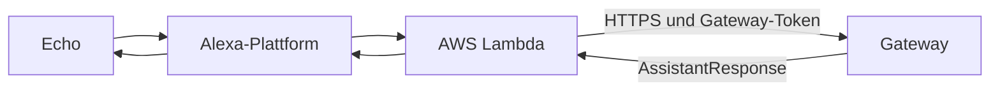

# Alexa anbinden

## Ziel

Alexa leitet eine freie Frage über Lambda an das bereits getestete Gateway
weiter und spricht dessen Antwort aus.

Beginne erst hier, wenn dieselbe Frage unter **Monitor / Test** funktioniert.

## Beteiligte Teile



Die Lambda ist ein dünner Adapter. Routing, Funktionen, Werkzeuge und LLM
bleiben im Gateway.

## Vorhandene Konfigurationsdateien

### Skill-Grundwerte

`alexa/skill.config.json` enthält:

```json
{
  "skill_name": "MeinHelfer",
  "invocation_name": "mein helfer",
  "assistant_name": "Dein Helfer"
}
```

### Lokale Skill-Zuordnung

Lege die ignorierte lokale Datei `alexa/skill.local.json` mit folgendem Inhalt
an:

```json
{
  "skill_id": "amzn1.ask.skill.<deine-id>"
}
```

Die Skill-ID wird für die Synchronisierung und zur Beschränkung des
Alexa-Skills-Kit-Triggers der Lambda verwendet. Sie ist kein Geheimnis und
ersetzt nicht den Gateway-Token. Für die automatisierten Deploy-Wege siehe
[Deployment und CI/CD](DEPLOYMENT.md).

### Lambda-Konfiguration

Die Vorlage `alexa/lambda/config.json.example` verlangt:

```json
{
  "gateway_url": "https://<gateway-host>",
  "gateway_token": "<AUTH_TOKEN des Gateways>",
  "watchdog_delay": "5",
  "gateway_timeout": "28",
  "skill_name": "MeinHelfer",
  "assistant_name": "Dein Helfer",
  "alexa_skill_id": "amzn1.ask.skill.<deine-id>"
}
```

`gateway_url` ist die Basisadresse; die Lambda ergänzt den API-Pfad gemäß
ihrer Implementierung. `gateway_token` muss mit `AUTH_TOKEN` übereinstimmen.
`alexa_skill_id` ist die Skill-ID, gegen die die Lambda eingehende
Alexa-Events prüft; abweichende `applicationId`s werden abgelehnt.

## Skill-Modell synchronisieren

Das vorhandene Skript verwendet die ASK-CLI-Anmeldedaten und die lokale
Skill-Zuordnung, um das Interaktionsmodell zu synchronisieren:

1. ASK CLI installieren und einmal mit `ask configure` anmelden.
2. `alexa/skill.local.json` anlegen.
3. Im Repository `python alexa/scripts/sync_skill.py` ausführen.
4. Den gemeldeten Build-Status des Interaction Model prüfen.

Optionen:

- `--force`: auch ohne erkannte Änderung synchronisieren

Das Skill-Manifest wird hier nicht verwaltet; es wird ausschließlich über den
Workflow `sync-manifest.yml` auf die Lambda-ARN gesetzt.

## Gateway-Zugriff

Die Lambda ruft ausschließlich `POST /api/query` auf und sendet dabei
`gateway_token` als Bearer-Token. Das Gateway prüft diesen Wert gegen
`AUTH_TOKEN`. Die Skill-ID wird nicht an das Gateway übertragen; Amazon
begrenzt bereits den Aufruf der Lambda auf den konfigurierten Skill.

Öffentlich erreichbar ist nur `/api/query`. Admin-UI und Admin-API bleiben im
internen Netz.

## Lambda bereitstellen

Für die automatisierten Deploy-Wege über GitHub Actions sowie die
AWS-/Alexa-Interna siehe [Deployment und CI/CD](DEPLOYMENT.md)
(Betreiber/Entwickler, ohne Secret-Werte).

### Manuell (Kurzfassung)

1. In AWS eine Lambda-Funktion `meinhelfer-alexa` anlegen (Handler
   `lambda_function.lambda_handler`, Timeout > 8 s, 512 MB) und eine
   Ausführungsrolle mit Lambda-Basic-Execution-Trust und CloudWatch-Logs-Policy
   verwenden.
2. Zip aus `alexa/lambda/` bauen (`lambda_function.py` + Abhängigkeiten) und
   hochladen.
3. Env-Variablen setzen: `gateway_url`, `gateway_token`, `alexa_skill_id`,
   `watchdog_delay=5`, `gateway_timeout=max(9, timeout-3)`, `skill_name`,
   `assistant_name`, `apl_exit_delay_ms=90000`.
4. Alexa-Skills-Kit-Trigger mit Skill-ID-Beschränkung hinzufügen.
5. Skill-Manifest-Endpoint auf den Funktions-ARN umstellen.
6. Rollback: vorheriges Zip erneut hochladen; Logs in CloudWatch auswerten.

## End-to-End-Prüfung

1. Frage im Gateway-Monitor testen.
2. Im Alexa Developer Console Simulator dieselbe Frage senden.
3. Auf einem echten Echo testen.
4. Gateway-Logs und Lambda-Logs vergleichen.
5. Einen langsamen Tool-Aufruf testen; der Warteton darf die finale Antwort
   nicht ersetzen.
6. Eine echte Mehrdeutigkeit testen; Alexa muss die Session für die Rückfrage
   offen halten.

## Häufige Abgrenzung

Music Assistant kann Audio über einen eigenen Alexa-Provider auf Echo-Geräten
wiedergeben. Dieser Skill steuert den Vorgang sprachlich; er streamt selbst
kein Audio zum Echo.
