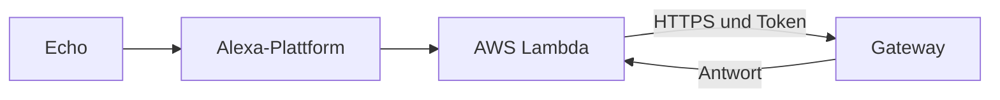

# Alexa anbinden

## Ziel

Diese Anleitung ist die Fortsetzung der [Installation](INSTALLATION.md). Dort
läuft das Gateway bereits und ist öffentlich per HTTPS erreichbar. Jetzt
verbindest du es mit Alexa. Jeder Abschnitt endet mit einem prüfbaren
Zwischenstand.

## Voraussetzungen

- Abgeschlossene [Installation](INSTALLATION.md): Das Gateway läuft, hat eine
  öffentliche HTTPS-Adresse, und `POST /api/query` antwortet mit dem
  Bearer-Token `AUTH_TOKEN`.
- Ein Amazon-Developer-Konto (vorhanden).
- Für Weg B zusätzlich ein AWS-Konto (vorhanden).

Die Einrichtung dieser Konten ist nicht Teil dieser Anleitung.

## Zwei Wege

| | Weg A: Alexa-hosted | Weg B: eigene AWS-Lambda |
|---|---|---|
| Aufwand | gering | mittel |
| AWS-Konto | nicht nötig | nötig |
| Backend | von Amazon gehostet | eigene Lambda |
| Grenzen | ca. 8 Sekunden Zeitlimit; Code und Token liegen im hosted Repo | Timeout frei wählbar, volle Kontrolle |
| Empfehlung | zum Ausprobieren | für den Betrieb |



In beiden Wegen bleibt das Gateway die Zentrale: Routing, Funktionen, Werkzeuge
und LLM. Die Lambda ist ein dünner Adapter und ruft `POST /api/query` auf.
Öffentlich erreichbar ist nur diese eine Route.

## 1. Skill anlegen

In der Alexa Developer Console:

1. **Create Skill**.
2. **Skill name**: z. B. `MeinHelfer` (frei wählbar).
3. **Default language**: **German (DE)**.
4. **Choose a type of experience**: **Other**.
5. **Choose a model to add to your skill**: **Custom**.
6. **Choose a method to host your skill's backend resources**:
   - Weg A: **Alexa-Hosted (Python)**
   - Weg B: **Provision your own**
7. **Create Skill**. Auf der Seite **Choose a template to add to your skill**
   **Start from Scratch** wählen (nicht „Import skill“) und mit
   **Continue with template** bestätigen.
8. Nach ein bis zwei Minuten öffnet sich der **Build**-Tab. Die **Skill-ID**
   steht unter **Build → Endpoint → „Your Skill ID“** (Format
   `amzn1.ask.skill.…`). Für Weg B wird sie gebraucht.

## 2. Interaktionsmodell

Im **Build**-Tab → **JSON Editor** folgendes Modell einsetzen (den
`invocationName` an den gewünschten Aufrufnamen anpassen), **Save Model** und
**Build Model** ausführen:

```json
{
  "interactionModel": {
    "languageModel": {
      "invocationName": "mein helfer",
      "intents": [
        { "name": "AMAZON.CancelIntent", "samples": [] },
        { "name": "AMAZON.HelpIntent", "samples": [] },
        { "name": "AMAZON.StopIntent", "samples": [] },
        { "name": "AMAZON.FallbackIntent", "samples": [] },
        {
          "name": "GptQueryIntent",
          "slots": [{ "name": "query", "type": "AMAZON.Person" }],
          "samples": ["{query}"]
        }
      ],
      "types": []
    }
  }
}
```

Das Einfügen ersetzt auch die Intents der Vorlage (`HelloWorldIntent`,
`AMAZON.NavigateHomeIntent`); für beide gibt es in der Lambda keinen Handler.

Das Modell legt fest:

- **Invocation Name** `mein helfer` – so wird der Skill geöffnet.
- Intent `GptQueryIntent` mit Slot `query` und Sample `{query}` für freie Fragen.
- `AMAZON.HelpIntent`, `AMAZON.CancelIntent`, `AMAZON.StopIntent`,
  `AMAZON.FallbackIntent`.

## 3. Weg A: Alexa-hosted

Beim hosted Skill liegen Code und Interaktionsmodell bei Amazon. Der Skill ist
in Schritt 1 mit **Alexa-Hosted (Python)** angelegt.

### 3.1 Interaktionsmodell

Wie in Schritt 2: **Build** → **JSON Editor**, Modell einsetzen, **Save Model**,
**Build Model**.

### 3.2 Lambda-Code und Abhängigkeiten

Im **Code**-Tab über **Import Code** das fertige Hosted-Zip laden:

`https://github.com/dezihh/meinhelfer/releases/download/latest/meinhelfer-alexa-hosted.zip`

Das Zip enthält `lambda/lambda_function.py`, `lambda/requirements.txt` und
`lambda/config.json.example` (datensichere Vorlage). Es enthält bewusst **kein
`config.json`** – die Konfiguration legst du gleich selbst an (3.3). Alternativ
die Dateien direkt im Code-Editor bearbeiten.

### 3.3 config.json

Im `lambda/`-Ordner eine `config.json` anlegen (Vorlage:
`config.json.example`, die Werte daraus übernehmen und anpassen):

```json
{
  "gateway_url": "https://<gateway-host>",
  "gateway_token": "<AUTH_TOKEN>",
  "skill_name": "MeinHelfer",
  "assistant_name": "Dein Helfer"
}
```

Hosted Skills haben keine Umgebungsvariablen wie Weg B; die Werte stehen daher
in dieser Datei. Sie liegt damit im hosted CodeCommit-Repo (nur für dein Konto
sichtbar).

### 3.4 Deploy und Test

**Deploy** klicken (lädt Abhängigkeiten, baut und deployt). Danach testen
(Schritt 5).

## 4. Weg B: eigene AWS-Lambda (empfohlen)

### 4.1 Lambda-Funktion anlegen

1. Fertiges Zip laden (jeweils der letzte Build):
   `https://github.com/dezihh/meinhelfer/releases/download/latest/meinhelfer-alexa-lambda.zip`
2. In AWS eine Lambda-Funktion `meinhelfer-alexa` anlegen:
   - Runtime Python 3.x, Handler `lambda_function.lambda_handler`
   - Timeout **größer als 8 Sekunden** (z. B. 30), 512 MB
   - Ausführungsrolle mit Lambda-Basic-Execution-Trust und CloudWatch-Logs
   - Das geladene Zip als Code hochladen
3. Umgebungsvariablen setzen:

| Variable | Wert |
|---|---|
| `gateway_url` | öffentliche Basisadresse des Gateways |
| `gateway_token` | muss dem `AUTH_TOKEN` des Gateways entsprechen |
| `alexa_skill_id` | Skill-ID; abweichende IDs werden abgelehnt |
| `watchdog_delay` | z. B. `5` (Warteton, wenn das Gateway länger braucht) |
| `gateway_timeout` | z. B. `28` (Timeout der Anfrage ans Gateway) |
| `skill_name` | Anzeigename, z. B. `MeinHelfer` |
| `assistant_name` | Name im Gespräch, z. B. `Dein Helfer` |
| `apl_exit_delay_ms` | z. B. `90000` (Anzeige auf dem Echo Show) |

### 4.2 Alexa-Trigger setzen

In der Lambda einen Trigger vom Typ **Alexa Skills Kit** hinzufügen und auf die
Skill-ID beschränken.

### 4.3 Endpoint im Manifest setzen

Im Skill-Manifest den Endpoint auf den Funktions-ARN der Lambda umstellen
(Developer Console → **Build** → **Endpoint** → **AWS Lambda ARN**). Den ARN
zeigt AWS in der Funktion oben an. Amazon prüft dabei den ARN-Fingerprint.

## 5. Testen

1. Dieselbe Frage im Gateway unter **Monitor / Test** stellen.
2. Im Alexa-Simulator der Console sprechen: „Alexa, öffne mein Helfer“.
3. Auf einem echten Echo testen.
4. Einen langsamen Aufruf testen; der Warteton darf die finale Antwort nicht
   ersetzen.
5. Eine echte Mehrdeutigkeit testen; die Rückfrage muss die Session offen halten.

## Namen und Aufrufname

Drei verschiedene Namen:

| Name | Wo | Ändern |
|---|---|---|
| **Invocation Name** („Alexa, öffne …“) | Interaktionsmodell, Feld `invocationName` (Build → **Invocation** oder **JSON Editor**) | Wert ändern, **Save Model** und **Build Model** |
| **Skill-Name** (Anzeige, Display-Titel) | Manifest; beim Anlegen gesetzt | Anzeigename in der Console ändern |
| **Assistenten-Name** (was der Assistent nennt) | Lambda: hosted `config.json` bzw. Weg B `assistant_name` | Wert ändern und neu deployen |

Regeln für den Invocation Name: mindestens zwei Wörter, keine Ziffern.

Zusätzlich in der Gateway-Admin-Oberfläche den **Assistenten-Name** passend
setzen, damit der Agent denselben Namen nennt. Hinweis: Der Gateway-Name ist
**global** – mehrere Skills an einem Gateway sprechen denselben Namen.

## Sprachen

Der Skill ist derzeit nur auf **Deutsch (de-DE)** eingerichtet. Eine weitere
Sprache braucht ein eigenes Interaktionsmodell für diese Locale und passende
Sprechtexte in der Lambda (aktuell nur `de-DE` hinterlegt).

## Nutzung

- Wecken und öffnen: „Alexa, öffne mein Helfer“.
- Freie Frage: „Alexa, frag mein Helfer, wie ist der Hausstatus“.
- Rückfragen: Bei zusammenfassenden Antworten bleibt die Session offen; „mehr
  dazu“ bezieht sich auf das letzte Thema.
- Chat-Modus: „starte chat modus“ beginnen, „chat beenden“ beenden.
- Beenden: „Alexa, stopp“ oder „Alexa, beenden“.
- Auf dem Echo Show wird die Antwort als Text angezeigt (scrollbar).

## Wenn etwas nicht klappt

- Keine Antwort: prüfen, ob `POST /api/query` mit dem Gateway-Token direkt
  antwortet (Gateway-Monitor).
- „Skill nicht gefunden“: Invocation Name im Modell prüfen.
- Lambda-Fehler: CloudWatch-Logs der Funktion `meinhelfer-alexa` ansehen.
- Antworten fehlen Fähigkeiten: Die eigentlichen Funktionen kommen über
  Installationspakete im Gateway, nicht über den Skill.

## Abgrenzung

Music Assistant kann Audio über einen eigenen Alexa-Provider auf Echo-Geräten
wiedergeben. Dieser Skill steuert den Vorgang sprachlich; er streamt selbst
kein Audio zum Echo.
