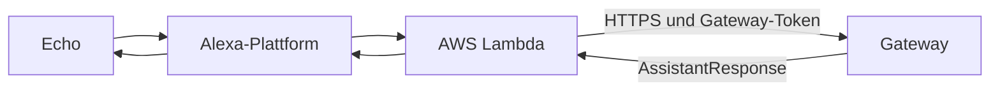

# Alexa anbinden

Diese Anleitung richtet die Alexa-Anbindung von Hand ein: Alexa-Skill,
AWS Lambda und Interaktionsmodell. Sie ist für Anwender gedacht, die den
Skill selbst aufsetzen. Beginne erst, wenn dieselbe Frage im Gateway unter
**Monitor / Test** funktioniert.

## Überblick



Die Lambda ist ein dünner Adapter. Routing, Funktionen, Werkzeuge und LLM
bleiben im Gateway. Öffentlich erreichbar ist nur `POST /api/query`.

## Was du brauchst

- Ein laufendes Gateway mit öffentlichem HTTPS-Zugang; `POST /api/query`
  antwortet mit dem Gateway-Token (`AUTH_TOKEN`) im Bearer-Header.
- Ein Amazon-Developer-Konto und ein AWS-Konto.
- Optional für den Modell-Sync: die ASK CLI (`ask configure`).

## 1. Skill anlegen

In der Alexa Developer Console:

1. **Create Skill** → Name `MeinHelfer`, Sprache **German (DE)**,
   Modell **Custom**, Backend **Provision your own**.
2. Als **Invocation Name** `mein helfer` eintragen (Groß-/Kleinschreibung
   spielt keine Rolle).
3. Intents anlegen:
   - `GptQueryIntent` mit Slot `query` (Typ `AMAZON.Person`) und Sample
     `{query}`
   - `AMAZON.HelpIntent`, `AMAZON.CancelIntent`, `AMAZON.StopIntent`,
     `AMAZON.FallbackIntent` (jeweils ohne Samples)
4. Modell speichern und bauen lassen (**Build Model**).

Invocation Name, Skill-Name und Assistenten-Name stehen in
`alexa/skill.config.json` (siehe Schritt 2) und werden daraus gerendert.

## 2. Grundwerte und Namen

`alexa/skill.config.json` ist die einzige Quelle für die Alexa-Namen und pro
Sprache aufgebaut:

```json
{
  "locales": {
    "de-DE": {
      "skill_name": "MeinHelfer",
      "invocation_name": "mein helfer",
      "assistant_name": "Dein Helfer"
    }
  }
}
```

| Feld | Bedeutung |
|---|---|
| `skill_name` | Anzeigename des Skills und Titel auf dem Echo-Display |
| `invocation_name` | Aufrufname („Alexa, öffne …“); mindestens zwei Wörter, keine Ziffern |
| `assistant_name` | Name, den der Assistent im Gespräch nennt |

Die Werte in Modell und Manifest rendert das Skript:

```bash
python3 alexa/scripts/skill_config.py --render-all
```

## 3. AWS Lambda bereitstellen

1. Fertiges Zip laden (jeweils der letzte Build):
   `https://github.com/dezihh/meinhelfer/releases/download/latest/meinhelfer-alexa-lambda.zip`
2. In AWS eine Lambda-Funktion `meinhelfer-alexa` anlegen:
   - Runtime Python 3.x, Handler `lambda_function.lambda_handler`
   - Timeout **größer als 8 Sekunden** (z. B. 30), 512 MB
   - Ausführungsrolle mit Lambda-Basic-Execution-Trust und CloudWatch-Logs
   - Das geladene Zip als Code hochladen
3. Umgebungsvariablen setzen:

| Variable | Wert |
|---|---|
| `gateway_url` | öffentliche Basisadresse des Gateways |
| `gateway_token` | muss dem `AUTH_TOKEN` des Gateways entsprechen |
| `alexa_skill_id` | Skill-ID (`amzn1.ask.skill.…`); abweichende IDs werden abgelehnt |
| `watchdog_delay` | z. B. `5` (Warteton, wenn das Gateway länger braucht) |
| `gateway_timeout` | z. B. `28` (Timeout der Anfrage ans Gateway) |
| `skill_name` | aus `skill.config.json` |
| `assistant_name` | aus `skill.config.json` |
| `apl_exit_delay_ms` | z. B. `90000` (Anzeige auf dem Echo Show) |

4. Alexa-Skills-Kit-Trigger hinzufügen: Trigger-Typ **Alexa Skills Kit**,
   Skill-ID-Beschränkung auf `alexa_skill_id`.

## 4. Endpoint im Manifest setzen

Im Skill-Manifest den Endpoint auf den Funktions-ARN der Lambda umstellen
(Alexa Developer Console → Endpoint → **AWS Lambda ARN**). Amazon prüft dabei
den ARN-Fingerprint. Den ARN zeigt AWS in der Funktion oben an.

## 5. Interaktionsmodell synchronisieren (Alternative)

Statt das Modell in der Console zu klicken, kannst du es aus dem Repository
synchronisieren:

1. `alexa/skill.local.json` anlegen (Vorlage: `alexa/skill.local.json.example`):

   ```json
   { "skill_id": "amzn1.ask.skill.<deine-id>" }
   ```

2. ASK CLI einmal anmelden (`ask configure`).
3. Ausführen:

   ```bash
   python3 alexa/scripts/sync_skill.py
   ```

   Das Skript rendert den Aufrufnamen aus `skill.config.json` und lädt alle
   eingetragenen Sprachen. `--force` erzwingt das Hochladen ohne Änderungsprüfung.

Die Skill-ID ist kein Geheimnis und ersetzt nicht den Gateway-Token.

## 6. Testen

1. Dieselbe Frage im Gateway-Monitor testen.
2. Im Alexa-Simulator der Console sprechen: „Alexa, öffne mein Helfer“.
3. Auf einem echten Echo testen.
4. Einen langsamen Aufruf testen; der Warteton darf die finale Antwort nicht
   ersetzen.
5. Eine echte Mehrdeutigkeit testen; die Rückfrage muss die Session offen halten.

## Namen ändern

1. `alexa/skill.config.json` anpassen und `skill_config.py --render-all` ausführen.
2. Interaktionsmodell neu synchronisieren (Schritt 5) bzw. Manifest/Modell in der
   Console aktualisieren.
3. Die Lambda-Umgebungsvariablen `skill_name` und `assistant_name` auf die neuen
   Werte setzen.
4. Den Gateway-Namen getrennt davon in der Admin-Oberfläche unter
   **Assistenten-Name** anpassen, damit der Agent denselben Namen nennt.

## Sprachen

Der Skill ist derzeit nur auf **Deutsch (de-DE)** eingerichtet. Eine weitere
Sprache ist ein zusätzlicher Eintrag unter `locales` in `skill.config.json`
plus eine Modell-Datei
`alexa/skill-package/interactionModels/custom/<locale>.json`. Die festen
Sprechtexte der Lambda sind aktuell nur für `de-DE` hinterlegt.

## Nutzung

- Wecken und öffnen: „Alexa, öffne mein Helfer“.
- Freie Frage: „Alexa, frag mein Helfer, wie ist der Hausstatus“.
- Rückfragen: Bei zusammenfassenden Antworten bleibt die Session offen; „mehr
  dazu“ bezieht sich auf das letzte Thema.
- Chat-Modus: „starte chat modus“ beginnen, „chat beenden“ beenden.
- Beenden: „Alexa, stopp“ oder „Alexa, beenden“.
- Auf dem Echo Show wird die Antwort als Text angezeigt (scrollbar).

## Wenn etwas nicht klappt

- Keine Antwort: prüfen, ob `POST /api/query` mit dem Gateway-Token direkt
  antwortet (Gateway-Monitor).
- „Skill nicht gefunden“: Invocation Name im Modell prüfen.
- Lambda-Fehler: CloudWatch-Logs der Funktion `meinhelfer-alexa` ansehen.
- Antworten fehlen Fähigkeiten: Die eigentlichen Funktionen kommen über
  Installationspakete im Gateway, nicht über den Skill.

## Abgrenzung

Music Assistant kann Audio über einen eigenen Alexa-Provider auf Echo-Geräten
wiedergeben. Dieser Skill steuert den Vorgang sprachlich; er streamt selbst
kein Audio zum Echo.
