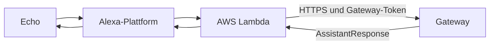

# Alexa anbinden

## Ziel

Alexa leitet eine freie Frage über Lambda an das bereits getestete Gateway
weiter und spricht dessen Antwort aus.

Beginne erst hier, wenn dieselbe Frage unter **Monitor / Test** funktioniert.

## Beteiligte Teile



Die Lambda ist ein dünner Adapter. Routing, Funktionen, Werkzeuge und LLM
bleiben im Gateway.

## Vorhandene Konfigurationsdateien

### Skill-Grundwerte

`alexa/skill.config.json` enthält:

```json
{
  "skill_name": "MeinHelfer",
  "invocation_name": "mein helfer",
  "assistant_name": "Dein Helfer"
}
```

### Lokale Skill-Zuordnung

Kopiere die Struktur aus `alexa/skill.local.json.example` in die ignorierte
lokale Datei `alexa/skill.local.json` und ersetze:

```json
{
  "skill_id": "amzn1.ask.skill.<deine-id>",
  "endpoint_url": "https://<gateway-host>/alexa",
  "privacy_url": "https://<gateway-host>/privacy"
}
```

### Lambda-Konfiguration

Die Vorlage `alexa/lambda/config.json.example` verlangt:

```json
{
  "gateway_url": "https://<gateway-host>",
  "gateway_token": "<AUTH_TOKEN des Gateways>",
  "watchdog_delay": "5",
  "gateway_timeout": "28",
  "skill_name": "MeinHelfer",
  "assistant_name": "Dein Helfer"
}
```

`gateway_url` ist die Basisadresse; die Lambda ergänzt den API-Pfad gemäß
ihrer Implementierung. `gateway_token` muss mit `AUTH_TOKEN` übereinstimmen.

## Skill-Modell synchronisieren

Das vorhandene Skript verwendet die ASK-CLI-Anmeldedaten und die lokale
Skill-Zuordnung:

1. ASK CLI installieren und einmal mit `ask configure` anmelden.
2. `alexa/skill.local.json` anlegen.
3. Im Repository `python alexa/scripts/sync_skill.py` ausführen.
4. Den gemeldeten Build-Status für Interaction Model und Manifest prüfen.

Optionen:

- `--model-only`: nur Interaktionsmodell
- `--manifest-only`: nur Manifest
- `--force`: auch ohne erkannte Änderung synchronisieren

## Gateway absichern

Setze im Gateway:

```dotenv
ALEXA_SKILL_ID=amzn1.ask.skill.<deine-id>
ALEXA_VERIFY_MODE=enforce
```

Der Skill-Endpunkt muss über HTTPS öffentlich erreichbar sein. Admin-UI und
Admin-API sollen nicht öffentlich erreichbar sein.

## Lambda bereitstellen

Im Repository existiert ein Workflow `deploy-aws-lambda.yml`. Eine
vollständige manuelle Anleitung einschließlich erstmaliger AWS-Ressourcen,
IAM-Rollen und erforderlicher GitHub-Secrets fehlt noch.

### Was noch dokumentiert werden muss

- Region und unterstützte Python-Laufzeit
- Erstellung der Lambda-Funktion
- Ausführungsrolle und minimale IAM-Rechte
- Alexa-Skills-Kit-Trigger und dessen Skill-ID-Beschränkung
- erforderliche GitHub-Secrets und Variablen
- Einbringen der produktiven `config.json`
- Rollback und Log-Auswertung in CloudWatch

### So wird das nachgebildet

1. Den Workflow von einem leeren AWS-Konto beziehungsweise einer neuen
   Funktion ausführen.
2. Jeden vorher manuell notwendigen AWS-Schritt protokollieren.
3. Secrets nur mit Namen und Zweck dokumentieren, niemals mit Werten.
4. Einen LaunchRequest und eine freie Frage testen.
5. CloudWatch- und Gateway-Trace derselben Anfrage gegenüberstellen.

## End-to-End-Prüfung

1. Frage im Gateway-Monitor testen.
2. Im Alexa Developer Console Simulator dieselbe Frage senden.
3. Auf einem echten Echo testen.
4. Gateway-Logs und Lambda-Logs vergleichen.
5. Einen langsamen Tool-Aufruf testen; der Warteton darf die finale Antwort
   nicht ersetzen.
6. Eine echte Mehrdeutigkeit testen; Alexa muss die Session für die Rückfrage
   offen halten.

## Häufige Abgrenzung

Music Assistant kann Audio über einen eigenen Alexa-Provider auf Echo-Geräten
wiedergeben. Dieser Skill steuert den Vorgang sprachlich; er streamt selbst
kein Audio zum Echo.
