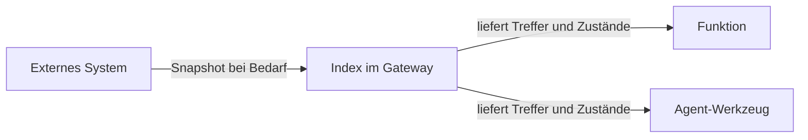

# Grundbegriffe

## Das Mentalmodell

Für die Einrichtung genügen vier Bausteine:

| Baustein | Einfache Erklärung | Beispiel |
|---|---|---|
| Werkzeug | führt einen Zugriff auf ein externes System aus | Licht einschalten |
| Index | liefert eine lokal gecachte, durchsuchbare Lesesicht | „Licht Küche“ finden |
| Funktion | kombiniert Datenzugriffe und formatiert ein Ergebnis | Hausstatus erzeugen |
| Vorgang | erkennt eine bekannte Frage und wählt den Antwortweg | „Wie ist der Hausstatus?“ |

## Werkzeug

Die meisten Werkzeuge kommen von einem MCP-Server in der **Tool-Registry**.
Der Agent kann freigegebene Werkzeuge direkt aufrufen; Funktionen verwenden
sie mit `mcp.call(...)`.

Werkzeuge eignen sich für gezielte oder schreibende Zugriffe, etwa Schalten,
Websuche oder Musikwiedergabe. Viele einzelne Leseaufrufe wären langsam. Dafür
gibt es den Index.

## Index

Ein Index ist eine lokal gespeicherte Lesesicht. Ein konfiguriertes
MCP-Werkzeug liefert bei Bedarf nach Ablauf des TTL-Fensters einen neuen
Snapshot; danach durchsucht das Gateway die Daten lokal.



Der Datenvertrag enthält eine Zeile pro Eintrag:

```text
id|area|state|unit|name|key=value;...
```

Der Index eignet sich zum Lesen und Finden. Er führt keine Aktion aus.
Schalten und Steuern bleiben Aufgabe eines Werkzeugs.

## Funktion

Eine Funktion ist ein benanntes Jinja/Nunjucks-Template. Ihr gerenderter Text
ist ihr Ergebnis.

| Baustein | Zweck |
|---|---|
| `index.find(...)` | passende Einträge lokal suchen |
| `index.state(...)` | Zustand eines Eintrags lesen |
| `index.get(...)` | Eintrag samt Zusatzdaten lesen |
| `mcp.call(...)` | ein MCP-Werkzeug aufrufen |
| `http(...)` | eine HTTP-Quelle lesen |
| `shell(...)` | kurzen Befehl im Gateway-Container ausführen |
| `fn(...)` | eine andere Funktion einbetten |
| `args` | übergebene Parameter lesen |
| `now` | aktuelle Gateway-Zeit lesen |

Eine Funktion kann von einem Vorgang ausgeführt werden. Außerdem sieht der
Agent aktive Funktionen als Werkzeuge namens `fn_<name>`. Ein Parameter-Schema
beschreibt dann deren Argumente.

## Vorgang

Ein Vorgang ordnet typische Formulierungen einem Modus zu. Der Router
vergleicht die Frage mit den Trigger-Phrasen. Passt keine Phrase, übernimmt
der allgemeine Agent.

### Deterministisch

```text
Frage → Vorgang → Funktion → Antwort
```

Kein LLM formuliert die Antwort. Das ist schnell und vorhersehbar.

### Hybrid

```text
Frage → Vorgang → Funktion → Daten → LLM formuliert → Antwort
```

Die Datenbeschaffung ist fest, die Sprache flexibel.

### LLM

```text
Frage → Agent → Werkzeuge oder Funktionen → Antwort
```

Der Agent entscheidet selbst. Dieser Modus eignet sich für offene,
kombinierte oder mehrdeutige Fragen.

## Wo Regeln hingehören

| Regelart | Ort |
|---|---|
| allgemeines Antwortverhalten | globales `agent_system` |
| Zuständigkeit und Kaskade eines Systems | Agent-Inventory-Prompt des MCP-Servers |
| Nutzung einer bestimmten Funktion | Agent-Inventory-Zeile der Funktion |
| Regeln nur für einen LLM-Vorgang | eigenes System-Prompt des Vorgangs |

So bleibt der globale Prompt kurz und das Fachwissen dort, wo es gepflegt
wird.
