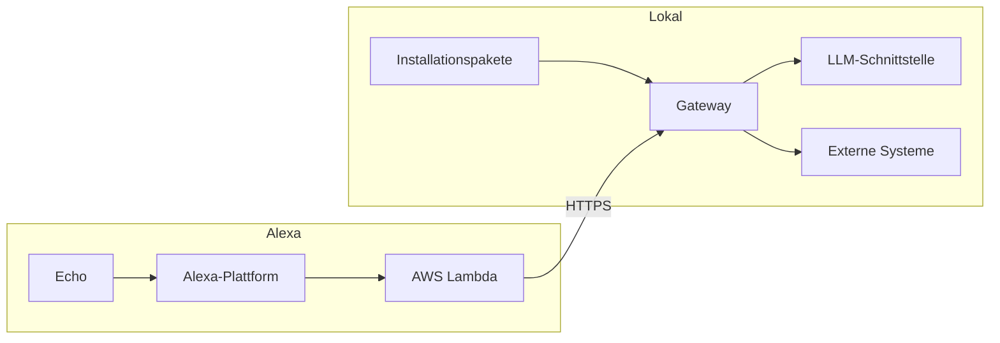

# Installation

## Ziel

In dieser Anleitung entsteht Schritt für Schritt ein vollständiges
MeinHelfer-Setup. Jeder Abschnitt endet mit einem funktionierenden,
überprüfbaren Zwischenstand. So lassen sich Fehler früh erkennen und der
Aufbau bleibt nachvollziehbar.

Zuerst läuft das Gateway lokal und beantwortet Fragen im Testmonitor. Danach
werden der öffentliche HTTPS-Zugang und die Alexa-Anbindung eingerichtet.
Passende Fähigkeiten kommen anschließend als Installationspakete hinzu.

## Zwei Teile eines Setups

Ein vollständiges Setup besteht aus zwei weitgehend getrennten Teilen:

| Teil | Aufgabe | Wird benötigt ab |
|---|---|---|
| Lokales Gateway | Gateway, Modell, Admin-Oberfläche und Testmonitor | jetzt |
| Alexa-Anbindung | öffentlicher HTTPS-Zugang, AWS Lambda und Alexa Skill | erst nach dem lokalen Test |

Das lokale Gateway ist ohne Alexa sinnvoll nutzbar und vollständig testbar.
Das ist absichtlich so: Für Einrichtung und Fehlersuche müssen weder ein Echo
noch ein AWS-Konto verfügbar sein.

Diese Trennung erlaubt außerdem, Alexa künftig durch einen anderen
Sprachkanal zu ersetzen, ohne das Gateway neu aufzubauen.



## Was du grundsätzlich brauchst

| Bereich | Benötigt | Wann |
|---|---|---|
| Server | Rechner, VM oder Homeserver für das Gateway | sofort |
| Laufzeit | Docker (mit Compose-Plugin) | sofort |
| KI-Modell | erreichbare OpenAI-kompatible Chat-Completions-Schnittstelle | sofort |
| Konfiguration | langer, zufälliger Admin-Token | sofort |
| Alexa | Amazon-Konto, AWS-Konto und öffentliche HTTPS-Adresse | erst für Alexa |

Der getestete und dokumentierte Installationsweg verwendet Docker Compose.
Das Gateway kann grundsätzlich auch direkt mit Node.js betrieben werden,
dieser Weg ist jedoch nicht getestet.

### Hinweis: Konfiguration sichern

Alle Einstellungen, Funktionen, Vorgänge und Index-Quellen liegen in der
SQLite-Datenbank (`gateway/data/meinhelfer.db`). Zwei Wege, das Setup zu
sichern:

- **Backup über die Admin-Oberfläche** (Tab „Wartung und Pakete“): lädt eine
  JSON-Sicherung der Konfiguration herunter; dieselbe Stelle bietet das
  Einspielen (Restore) zurück.
- **Datenvolume sichern**: den Ordner `gateway/data/` mit üblichen
  Mitteln (rsync, Snapshot) kopieren, während der Container gestoppt ist.

## Lokales Gateway

Diese Variablen liest der Gateway-Code beim Start:

| Variable | Pflicht | Bedeutung |
|---|---|---|
| `AUTH_TOKEN` | ja | schützt Admin- und API-Zugriffe |
| `LLM_BASE_URL` | ja | Basis-URL der OpenAI-kompatiblen Schnittstelle |
| `LLM_API_KEY` | ja | API-Schlüssel; der Prozess verlangt einen Wert |
| `PORT` | nein | Gateway-Port, Standard `3000` |
| `DB_PATH` | nein | SQLite-Datei im persistierten Datenvolume, Standard `./data/meinhelfer.db` |
| `LLM_MODEL` | nein | Name des LLM-Modells, Standard `chat-fast`  |
| `LLM_MAX_TOKENS` | nein | Ausgabe-Budget, Standard `2000` |

Weitere optionale Variablen (Tool-Runden, Deadline, Keepalive) sind
in der [Referenz](REFERENCE.md#laufzeitkonfiguration) aufgelistet. Für die
Alexa-Anbindung über AWS Lambda benötigt das Gateway keine Alexa-spezifischen
Umgebungsvariablen. Die Lambda greift mit `AUTH_TOKEN` auf `/api/query` zu.

### LLM-Modell wählen

Das Modell muss Tool-Aufrufe und zuverlässige JSON-Antworten unterstützen.
Für Sprachdialoge sind zudem kurze Zeit bis zum ersten Token, geringe
Gesamtlatenz und ausreichend Kontext für System-Prompt, Tool-Definitionen und
Ergebnisse wichtig. Als schneller Einstieg bietet sich ein aktuelles
Flash-Modell an, etwa Gemini 3.x Flash, sofern es über den gewählten
OpenAI-kompatiblen Endpunkt Tool-Calling unterstützt.

Modelle mit umfangreichem Reasoning können komplexe Kaskaden besser lösen,
benötigen aber häufig mehr Zeit und ein höheres Ausgabe-Budget. Teste das
gewählte Modell zunächst im Testmonitor, bevor du Pakete oder Alexa ergänzt.

## Installation


### Voraussetzungen

- Docker auf dem Server
- Zugangsdaten für eine OpenAI-kompatible LLM-Schnittstelle

### Schritte

1. Repository klonen:

       git clone https://github.com/dezihh/meinhelfer.git
       cd meinhelfer

2. Konfiguration anlegen:

       cp gateway/.env.example gateway/.env

   Öffne anschließend `gateway/.env` und trage mindestens Folgendes ein:

   ```dotenv
   AUTH_TOKEN=<langen-zufälligen-wert-eintragen>
   LLM_BASE_URL=https://<llm-endpunkt>/v1
   LLM_API_KEY=<api-schlüssel>
   LLM_MODEL=<LLM-modellname>
   ```

   `DB_PATH` kann auf dem Standardwert bleiben. Die Compose bindet das
   Verzeichnis `gateway/data` als persistentes Volume ein; darin liegt die
   SQLite-Datenbank. Dieses Verzeichnis nicht löschen, wenn Konfiguration,
   Pakete, Funktionen und Vorgänge ein Update überleben sollen.

3. Container bauen und starten; Host-Port wählen:

       GATEWAY_PORT=3000 docker compose up -d --build

   `GATEWAY_PORT` ist nur das Host-Port-Mapping (der Code liest `PORT`,
   im Container 3000). Ohne Angabe: Port 3000.

4. Admin-Oberfläche öffnen: `http://<host>:<port>/admin` — Login mit
   `AUTH_TOKEN` (Login-Seite: `/admin/login.html`).

5. Testmonitor prüfen (Tab „Monitor / Test“): eine Frage stellen und eine
   Antwort erwarten.

Weitere Fähigkeiten installierst du später über Pakete im Tab
„Wartung und Pakete“ oder richtest sie manuell ein.

### Prüfen

- Monitor-Antwort auf „Wie heißt du?“ korrekt mit dem Assistenten-Namen.
- Ein Browser ohne Session wird zur Login-Seite umgeleitet; unberechtigte
   Admin-API-Aufrufe erhalten `401`.
- Nach `docker compose restart` bleiben die Daten erhalten.

## Netzwerk und HTTPS

Das Gateway funktioniert nun lokal. Bevor du Alexa vollständig einrichten und
mit dem Gateway verbinden kannst, benötigt es eine öffentlich erreichbare
HTTPS-Adresse.

Dafür werden benötigt:

- ein DNS-Eintrag, der auf eine statische öffentliche IP-Adresse oder einen
   aktuellen DynDNS-Namen zeigt,
- ein zum DNS-Namen passendes, öffentlich vertrauenswürdiges TLS-Zertifikat,
- eine Portweiterleitung für TCP 443 auf den TLS-Endpunkt und
- eine Trennung zwischen den wenigen öffentlichen URLs und dem internen
   Zugriff auf WebUI und Administration.

Leite den Gateway-Port `3000` nicht aus dem Internet weiter. Die öffentliche
Freigabe erfolgt ausschließlich über Port 443 der vorgeschalteten
TLS-Komponente; andernfalls ließen sich deren URL-Regeln umgehen.

Das Gateway spricht selbst nur HTTP und kann TLS nicht terminieren. Deshalb ist
eine vorgelagerte TLS-Terminierung zwingend erforderlich. Das kann ein
Reverse-Proxy, eine Application Firewall, ein Load-Balancer oder ein
vergleichbarer HTTPS-Dienst übernehmen. Ein Reverse-Proxy ist also nur dann
optional, wenn bereits eine andere Komponente diese Aufgaben erfüllt. Eine
reine Portweiterleitung ohne TLS-Terminierung genügt nicht.

Router und klassische Firewalls können Port 443 weiterleiten. Eine Freigabe
nach URL-Pfaden benötigt dagegen eine Komponente auf Anwendungsebene, die den
entschlüsselten HTTP-Pfad auswertet. Öffentlich benötigt werden:

| URL | Erforderlich | Schutz |
|---|---|---|
| `/api/query` | ja | Bearer-Token (`AUTH_TOKEN`) und Rate-Limit |
| `/api/lambda-trace` | nur vorübergehend zur Diagnose | Bearer-Token (`AUTH_TOKEN`) und Rate-Limit |

`/api/lambda-trace` meldet die Ereignisse `invoke` und `response_sent` sowie
die in der Lambda gemessene Dauer an das Gateway. Das erleichtert die
Abgrenzung von Fehlern zwischen Alexa, Lambda und Gateway. Das Gateway
speichert diese Meldungen nur, wenn `debug_logging` aktiviert ist; andernfalls
verwirft es sie. `response_sent` bedeutet dabei nur, dass die Lambda die
Gateway-Antwort verarbeitet hat, nicht dass Alexa sie erfolgreich ausgegeben
hat.

Für den normalen Betrieb sollte diese Route geschlossen bleiben. Die
Sprachabfrage funktioniert ohne sie vollständig, weil die Trace-Aufrufe
nebenläufig erfolgen. Die aktuelle Lambda versucht sie dennoch und schreibt
bei einer gesperrten Route eine Warnung in ihr CloudWatch-Log. Für eine
gezielte Fehlersuche kann die Route vorübergehend zusammen mit
`debug_logging` freigegeben werden.

Testmonitor, WebUI, Admin-Oberfläche und Admin-API bleiben ausschließlich im
internen Netz.

### Referenzaufbau mit nginx

Der öffentliche nginx-VHost beendet TLS und leitet nur die benötigten URLs an
das Gateway weiter. `limit_req_zone` gehört in den `http`-Block der
nginx-Konfiguration; der `server`-Block steht darin daneben.

```nginx
# Im http-Block, außerhalb des server-Blocks
limit_req_zone $binary_remote_addr zone=gateway_api:10m rate=5r/s;

server {
	listen 443 ssl;
	http2 on;
	server_name <gateway-host>;

	ssl_certificate     /etc/letsencrypt/live/<gateway-host>/fullchain.pem;
	ssl_certificate_key /etc/letsencrypt/live/<gateway-host>/privkey.pem;
	ssl_protocols TLSv1.2 TLSv1.3;

	# Im Normalbetrieb nur den erforderlichen Lambda-Aufruf veröffentlichen
	location = /api/query {
		limit_req zone=gateway_api burst=20 nodelay;
		client_max_body_size 1m;

		proxy_pass http://<gateway-intern>:3000;
		proxy_http_version 1.1;
		proxy_set_header Host $host;
		proxy_set_header X-Real-IP $remote_addr;
		proxy_set_header X-Forwarded-For $proxy_add_x_forwarded_for;
		proxy_set_header X-Forwarded-Proto $scheme;
		proxy_connect_timeout 5s;
		proxy_read_timeout 35s;
	}

	# WebUI, Admin-API und alle übrigen Gateway-Routen bleiben intern
	location / { return 404; }
}
```

Hinweise:

- `proxy_read_timeout 35s` lässt ausreichend Puffer für die auf 28 Sekunden
   konfigurierte Gateway-Anfrage der Lambda.
- Die Lambda kommt aus AWS und kann normalerweise nicht auf eine lokale
   IP-Allowlist beschränkt werden. Bearer-Token und Rate-Limit schützen daher
   `/api/query`.
- Das Zertifikat kann beispielsweise von Let's Encrypt oder einer anderen
   öffentlich vertrauenswürdigen Zertifizierungsstelle stammen.
- Die Lambda ruft `gateway_url` (Basisadresse) auf und ergänzt selbst den
   jeweiligen API-Pfad.
- Der interne Zugriff auf `/admin` erfolgt nicht über diesen öffentlichen
   VHost, sondern direkt im LAN oder über einen getrennten internen VHost.

### Sicherheitsziel

Im Normalbetrieb ist nur `/api/query` öffentlich erreichbar und durch den
Bearer-Token geschützt. Alle übrigen Routen einschließlich Admin-Oberfläche
und Admin-API gehören ins lokale Netz.

## Alexa anbinden

Gateway und öffentlicher HTTPS-Zugang sind nun vorbereitet. Im letzten Schritt
richtest du Skill und AWS Lambda ein. Die Skill-ID begrenzt dabei den
Alexa-Trigger der Lambda; die Lambda authentisiert sich mit `AUTH_TOKEN` am
öffentlichen API-Weg des Gateways. Die vollständige Einrichtung von Skill,
Interaktionsmodell, AWS Lambda und Manifest ist in [Alexa anbinden](ALEXA.md)
beschrieben.

## Abnahme

Sprich: „Alexa, frage Mein Helfer, wie du heißt.“ Alexa gibt die Antwort des
Gateways aus. Damit ist der vollständige Weg von Alexa über AWS Lambda und den
öffentlichen HTTPS-Endpunkt bis zum Gateway geprüft. Im Gateway-Log erscheint
die Anfrage mit Route und Dauer.

## Nächster Schritt: Pakete installieren

Das Grundsystem ist damit vollständig installiert. Seine eigentlichen
Fähigkeiten erhält MeinHelfer über Installationspakete. Öffne in der
Admin-Oberfläche den Tab **Wartung und Pakete**, wähle ein Paket für das
gewünschte Zielsystem und folge dessen Einrichtungshinweisen.

Eine Übersicht über Aufbau und Sicherheitsmodell der Paket-Registry steht
unter [Pakete](../packages/README.md).
