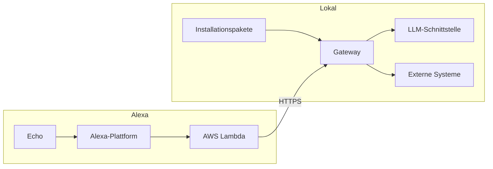

# Installation

## Ziel

In dieser Anleitung entsteht Schritt für Schritt ein vollständiges
MeinHelfer-Setup. Jeder Abschnitt endet mit einem funktionierenden,
überprüfbaren Zwischenstand. So lassen sich Fehler früh erkennen und der
Aufbau bleibt nachvollziehbar.

Zuerst läuft das Gateway lokal und beantwortet Fragen im Testmonitor. Danach
kommen passende Fähigkeiten als Installationspakete hinzu. Alexa wird erst am
Ende angebunden, wenn der lokale Weg bereits zuverlässig funktioniert.

## Zwei Teile eines Setups

Ein vollständiges Setup besteht aus zwei weitgehend getrennten Teilen:

| Teil | Aufgabe | Wird benötigt ab |
|---|---|---|
| Lokales Gateway | Gateway, Modell, Admin-Oberfläche, Pakete und Testmonitor | dem ersten Schritt |
| Alexa-Anbindung | öffentlicher HTTPS-Zugang, AWS Lambda und Alexa Skill | erst nach dem lokalen Test |

Das lokale Gateway ist ohne Alexa sinnvoll nutzbar und vollständig testbar.
Das ist absichtlich so: Für Einrichtung und Fehlersuche müssen weder ein Echo
noch ein AWS-Konto verfügbar sein.



## Was du grundsätzlich brauchst

| Bereich | Benötigt | Wann |
|---|---|---|
| Server | Rechner, VM oder Homeserver für das Gateway | sofort |
| Laufzeit | Docker mit Compose-Plugin | sofort |
| KI-Modell | erreichbare OpenAI-kompatible Chat-Completions-Schnittstelle | sofort |
| Konfiguration | langer, zufälliger Admin-Token | sofort |
| Fähigkeiten | je nach Bedarf externe Systeme, etwa Home Assistant oder Websuche | nach dem Grundtest |
| Alexa | Amazon-Konto, AWS-Konto und öffentliche HTTPS-Adresse | erst für Alexa |

Home Assistant ist keine Voraussetzung für MeinHelfer. Nach dem Grundtest
wählst du die Fähigkeiten, die du tatsächlich brauchst, als
Installationspakete aus.

Der getestete und dokumentierte Installationsweg verwendet Docker Compose.
Das Gateway kann voraussichtlich auch direkt mit Node.js betrieben werden,
dieser Weg ist jedoch nicht getestet und gehört deshalb nicht in diese
Anleitung.

## Aufbau in Etappen

| Etappe | Ergebnis | Prüfung |
|---|---|---|
| 1. Gateway starten | Admin-Oberfläche ist erreichbar | Anmeldung mit Admin-Token |
| 2. Modell prüfen | Testmonitor beantwortet eine allgemeine Frage | „Wie heißt du?“ liefert eine Antwort |
| 3. Fähigkeit installieren | Ein Paket ergänzt ein konkretes System | Paketvorschau, Installation und Monitor-Test |
| 4. Konfiguration sichern | Setup kann wiederhergestellt werden | Sicherung herunterladen und prüfen |
| 5. Alexa anbinden | Dieselbe Anfrage funktioniert über Alexa | Simulator und Echo testen |

Die folgenden Abschnitte behandeln zunächst den lokalen Teil. Die Alexa-
Anbindung folgt erst, wenn die ersten vier Etappen abgeschlossen sind.

## Gateway-Umgebung

Diese Variablen liest der Gateway-Code beim Start:

| Variable | Pflicht | Bedeutung |
|---|---|---|
| `AUTH_TOKEN` | ja | schützt Admin- und API-Zugriffe |
| `LLM_BASE_URL` | ja | Basis-URL der OpenAI-kompatiblen Schnittstelle |
| `LLM_API_KEY` | ja | API-Schlüssel; der Prozess verlangt einen Wert |
| `PORT` | nein | Gateway-Port, Standard `3000` |
| `DB_PATH` | nein | SQLite-Datei im persistierten Datenvolume, Standard `./data/meinhelfer.db` |
| `LLM_MODEL` | ja | Name des am LLM-Endpunkt bereitgestellten Modells |
| `LLM_MAX_TOKENS` | nein | Ausgabe-Budget, Standard `2000` |

Die Alexa-spezifischen Variablen werden erst im Kapitel zur Alexa-Anbindung
benötigt und dort erklärt.

### Modell wählen

Das Modell muss Tool-Aufrufe und zuverlässige JSON-Antworten unterstützen.
Für Sprachdialoge sind zudem kurze Zeit bis zum ersten Token, geringe
Gesamtlatenz und ausreichend Kontext für System-Prompt, Tool-Definitionen und
Ergebnisse wichtig. Als schneller Einstieg bietet sich ein aktuelles
Flash-Modell an, etwa Gemini 3.5 Flash, sofern es über den gewählten
OpenAI-kompatiblen Endpunkt Tool-Calling unterstützt.

Modelle mit umfangreichem Reasoning können komplexe Kaskaden besser lösen,
benötigen aber häufig mehr Zeit und ein höheres Ausgabe-Budget. Teste das
gewählte Modell zunächst im Testmonitor, bevor du Pakete oder Alexa ergänzt.

## Docker-Compose-Installation

Getestet mit frischem Clone und leerem Datenvolume (22.09.2026).

### Voraussetzungen

- Docker mit Compose-Plugin
- Eine ausgefüllte `gateway/.env` (Vorlage: `gateway/.env.example`)

### Schritte

1. Repository klonen:

       git clone https://github.com/dezihh/meinhelfer.git
       cd meinhelfer

2. Konfiguration anlegen:

       cp gateway/.env.example gateway/.env

   Öffne anschließend `gateway/.env` und trage mindestens Folgendes ein:

   ```dotenv
   AUTH_TOKEN=<langen-zufälligen-wert-eintragen>
   LLM_BASE_URL=https://<llm-endpunkt>/v1
   LLM_API_KEY=<api-schlüssel>
   LLM_MODEL=<tool-fähiger-modellname>
   ```

   `DB_PATH` kann auf dem Standardwert bleiben. Die Compose bindet das
   Verzeichnis `gateway/data` als persistentes Volume ein; darin liegt die
   SQLite-Datenbank. Dieses Verzeichnis nicht löschen, wenn Konfiguration,
   Pakete, Funktionen und Vorgänge ein Update überleben sollen.

3. Container bauen und starten; Host-Port waehlen:

       GATEWAY_PORT=8332 docker compose up -d --build

   `GATEWAY_PORT` ist nur das Host-Port-Mapping (der Code liest `PORT`,
   im Container 3000). Ohne Angabe: Port 3000.

4. Admin-Oberflaeche oeffnen: `http://<host>:<port>/admin` — Login mit
   `AUTH_TOKEN` (Login-Seite: `/admin/login.html`, geschuetzt gegen
   Brute-Force-Rate-Limit).

5. Testmonitor pruefen (Tab „Monitor / Test"): eine Frage stellen und eine
   Antwort erwarten.

### Was die Compose tut

- Baut und startet das Gateway als Container
- `./gateway/data` als persistentes Volume fuer `DB_PATH`
  (`./data/meinhelfer.db` im Container)
- Uebergibt alle Variablen aus `gateway/.env` an den Container
- Restart-Strategie `unless-stopped`

Die zwei Basis-Werkzeuge `fn_find_entities` und `fn_get_entity` sind
**fest im Gateway-Code eingebaut** (built-in): sie erscheinen bewusst **nicht**
in der Tab „Funktionen", sind nicht editierbar und werden von keinem Backup,
Restore oder Paket angefasst - die Lesefaehigkeit des Agenten ist damit
unzerstoerbar. Die Anbindung an einen Dienst steckt im Entity-Index-Setting
(Tab „Index-Quellen"), nicht im Werkzeugnamen.

Ebenfalls Grundausstattung ist die generische **Hilfe-Action** `hilfe`
(„was kannst du?", „hilfe"): sie listet die im Tool-Inventory beschriebenen
Faehigkeiten auf, ohne selbst Tools zu rufen - je nach installierten Paketen
also automatisch passend. Sie ist editierbar und liegt im Seed.

Alles Weitere - MCP-Server, Entity-Index, weitere Funktionen, weitere
Vorgaenge - kommt bewusst nicht automatisch, sondern ueber die
**Installationspakete** (Tab „Wartung und Pakete") oder manuell.

### Prüfen

- Monitor-Antwort auf „wie heisst du" korrekt mit dem Assistenten-Namen.
- Admin-Oberflaeche 401 ohne Session, Login-Seite 200.
- Nach `docker compose restart` bleiben die Daten erhalten.

## LLM-Schnittstelle

Das Gateway erwartet eine OpenAI-kompatible `chat/completions`-Schnittstelle.
Der konkrete Modellserver ist austauschbar und nicht Teil des Repositories.

### Was noch fehlt

- unterstützte Anbieter oder lokale Server
- korrektes Format der jeweiligen `LLM_BASE_URL`
- getestete Modellnamen
- Referenzwerte für Tokenbudget und Timeouts
- Installation eines optionalen Tool-Modells

### Mindestprüfung

Das Modell muss Tool-Aufrufe beherrschen und finales JSON entsprechend dem
Agent-Prompt liefern. Ein reiner Chat-Endpunkt ohne Tool-Calling genügt für
Agent-Vorgänge nicht.

## Netzwerk und HTTPS

Der Testmonitor funktioniert lokal. Alexa benötigt einen öffentlich
erreichbaren HTTPS-Weg zum Skill-Endpunkt.

### Was noch fehlt

- unterstützter Reverse Proxy
- TLS- und Weiterleitungsbeispiel
- öffentlicher Pfad für `/alexa`
- LAN-Beschränkung für Admin-Oberfläche und `/admin/*`
- Firewall- und Rate-Limit-Regeln

### Sicherheitsziel

Nur der Alexa-Endpunkt soll öffentlich erreichbar sein. Admin-Oberfläche und
Admin-API gehören ins lokale Netz. Für öffentliche Deployments muss die
Alexa-Signaturprüfung auf `enforce` stehen.

## Abnahme

- Gateway startet mit dokumentiertem Befehl.
- SQLite-Daten bleiben nach Neustart erhalten.
- Admin-Token schützt Oberfläche und API.
- Testmonitor liefert eine Antwort.
- Logs zeigen Route, Dauer und Antwort.
- Bei Alexa-Nutzung ist nur der notwendige Endpoint öffentlich exponiert.
