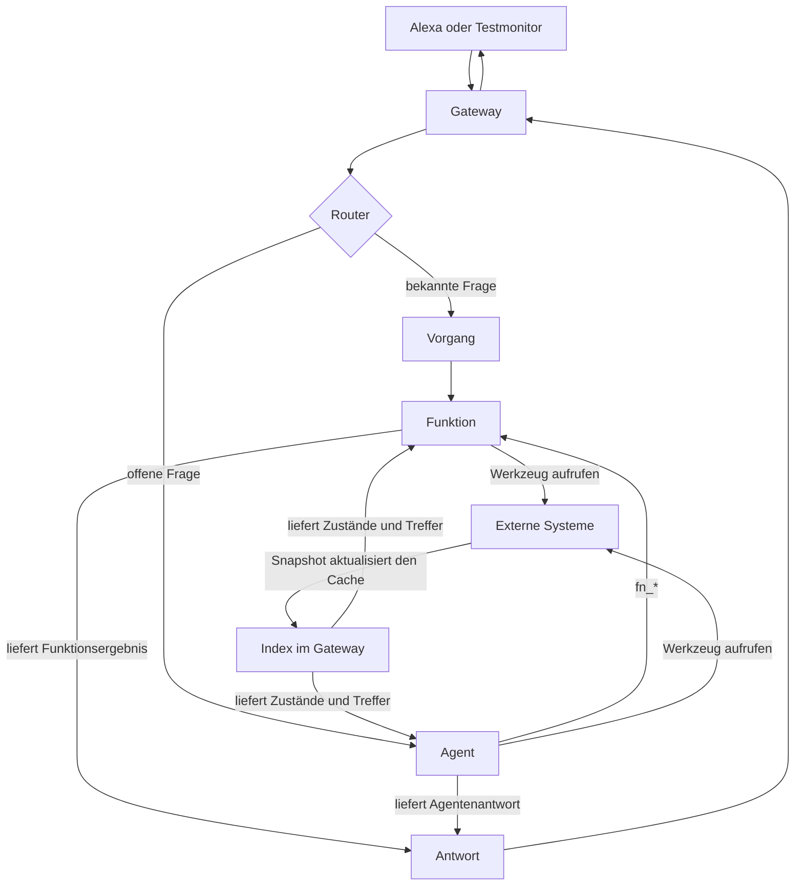

# MeinHelfer einrichten und verstehen

Diese Dokumentation ist ein neuer, leichter zugänglicher Entwurf. Sie lässt die
bisherigen Dateien in `doc/` und den bisherigen `README.md` unverändert.

Du musst nicht zuerst die gesamte Architektur verstehen. Für den Einstieg
reichen vier Begriffe und ein vollständiger Einrichtungsweg.

## In fünf Minuten orientieren

MeinHelfer nimmt eine Frage entgegen und wählt dann einen von zwei Wegen:

- Ein **Vorgang** erkennt eine bekannte Frage und führt eine fest zugewiesene
  Funktion aus.
- Der **Agent** bearbeitet offene Fragen und entscheidet selbst, welche
  freigegebenen Werkzeuge oder Funktionen er benötigt.

Eine **Funktion** holt Daten und erzeugt daraus ein Ergebnis. Dazu kann sie
einen schnellen **Index**, ein MCP-Werkzeug, einen Webdienst oder einen
Shell-Befehl verwenden.

Der Index ist kein weiteres Zielsystem. Er ist eine lokal gecachte Lesesicht
auf Daten eines externen Systems. Bei Bedarf lädt das Gateway nach Ablauf des
TTL-Fensters einen neuen Snapshot. Der Index liefert daraus Zustände und
Suchtreffer an Funktionen oder den Agenten, ohne für jede Frage erneut das
Zielsystem abzufragen.

## Empfohlener Lernpfad

1. [Schnellstart](QUICKSTART.md): Einen ersten Vorgang im Testmonitor zum
   Laufen bringen.
2. [Grundbegriffe](CONCEPTS.md): Werkzeuge, Index, Funktionen und Vorgänge
   sicher unterscheiden.
3. [Installation](INSTALLATION.md): Gateway, Modell und Netzwerk vorbereiten.
4. [Konfiguration](CONFIGURATION.md): Grundeinstellungen und Admin-Oberfläche
   parametrieren.
5. [Cache und Aktualität](CACHE.md): Verstehen, wann Daten lokal bleiben und
   wann Netzwerkverkehr entsteht.
6. [Praxisrezepte](RECIPES.md): Home Assistant, Musik, Websuche und Berichte
   schrittweise einrichten.
7. [Alexa anbinden](ALEXA.md): Erst anbinden, wenn der Testmonitor antwortet.
8. [Fehler beheben](TROUBLESHOOTING.md): Fehler anhand klarer Prüfpunkte
   eingrenzen.
9. [Referenz](REFERENCE.md): Felder, Grenzen und technische Details
   nachschlagen.

## Was du für den ersten Erfolg brauchst

- Ein laufendes Gateway
- Eine OpenAI-kompatible LLM-Schnittstelle
- Den Admin-Token des Gateways
- Für das erste Home-Assistant-Beispiel: einen erreichbaren HA-MCP-Server
- Noch **keine** Alexa-Anbindung; der Monitor genügt zum Einrichten und Testen

## Drei Modi, kurz erklärt

| Modus | Merksatz | Geeignet für |
|---|---|---|
| `deterministic` | Funktion ausführen und Ergebnis direkt sprechen | feste Messwerte und Berichte |
| `hybrid` | Funktion liefert Daten, das LLM formuliert | variable Listen und natürlichere Einordnung |
| `llm` | Agent wählt Werkzeuge und Funktionen selbst | offene, kombinierte oder mehrdeutige Fragen |

Faustregel: **So deterministisch wie möglich, so agentisch wie nötig.**

## Noch nicht belastbar dokumentiert

Die folgenden Angaben lassen sich aus dem Repository derzeit nicht vollständig
ableiten. Die zugehörigen Kapitel sind trotzdem angelegt und beschreiben
jeweils, welche Information noch ergänzt und wie sie geprüft werden muss.

- Offiziell unterstützter Installationsweg für das Gateway
- Vollständige Docker- beziehungsweise Compose-Konfiguration
- Installation und Betrieb der OpenAI-kompatiblen LLM-Schnittstelle
- Referenzaufbau für Domain, TLS und Reverse Proxy
- Vollständiger manueller AWS-Lambda- und Alexa-Deploymentweg
- Unterstützte Host-Betriebssysteme und Mindestanforderungen

Eine zentrale Liste steht in [Offene Angaben](OPEN_QUESTIONS.md).

## Schreibprinzip dieses Entwurfs

Jede Anleitung trennt vier Dinge:

1. **Ziel:** Was funktioniert danach?
2. **Einrichtung:** Wo wird welcher Wert eingetragen?
3. **Prüfung:** Woran erkennst du, dass der Schritt funktioniert?
4. **Hintergrund:** Warum ist der Schritt nötig und welche Grenzen gibt es?

Der Hauptweg bleibt kurz. Technische Begründungen und Sonderfälle stehen am
Ende eines Abschnitts oder in der Referenz, gehen aber nicht verloren.